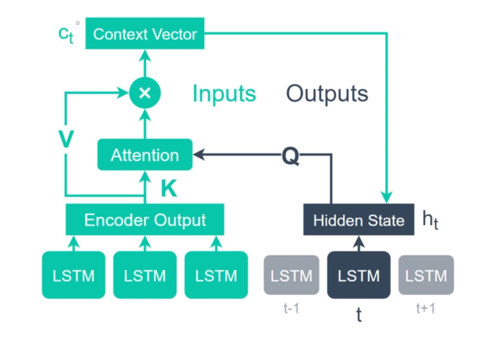

# Natural Language Processing using Transformer

## Word 2 Vector

### Word to vector relates different words encoded and relates the different words to give better meaning of the all over words between them.

### This can actually produce real word realtionship between words.

## Using Neural Networks

- ### Creating a embedding layer
- ### passing to RNN or LSTM or Bidirection-LSTM
- ### This consider the prfernance of order of words.(as it is important)
- ### RNN has a **Vanishing Gradient Problem/Exploding Gradient Problem** .
- ### Solution for the problem came as LSTM(Long Short Term Memory Unit)
- ### this allowed long term dependenceis to be learned using the cell state in LSTM.

## Now Using Attention:

- ### Encoder and Decoder were earler linked direclty to each layer, which created a information bottleneck.
- ### Not enought infomation to be pass throught the last LSTM of the encoder to the first LSTM of the decoder
- ### So all the collections of the hiddent states which produces a attention matrix
- ### Finding the alighment between the encoder and decoder states.
- 
- ### Query , Key ,Value

## Self Attention: (Attention is you need)

- ### Self-attention
  - #### allowed us to remove query) working with in same sentence
- ### Multi-head attention

  - #### Produces multipel linear layers. we get different attentions. we have mant representation of the attention encoding.
  - #### Process of having multiple attention head ---> we need to concat them.
  - #### we then passs through a linear layer.

- ### Postitional encoding
  - #### input to transformer is not sequencital.
  - #### To maintain positional encoding is added to the word embedding, before enterign the attention mechanism.
  
## So we get a resulting architecture which is  a transformer.
 

